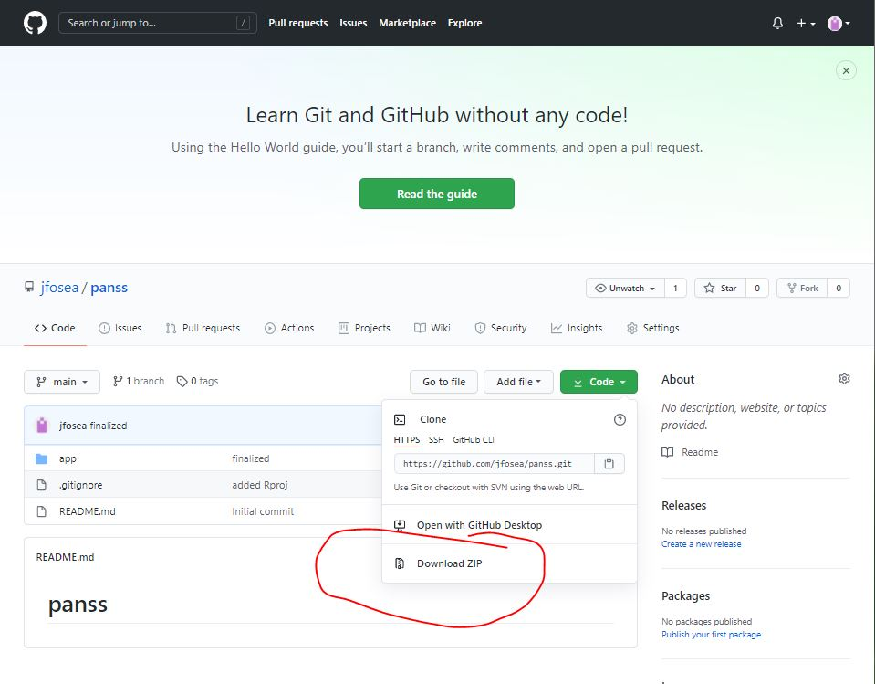
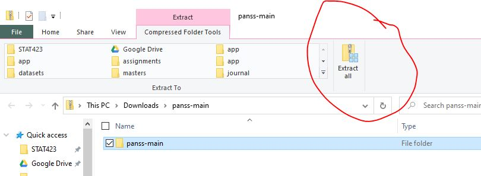
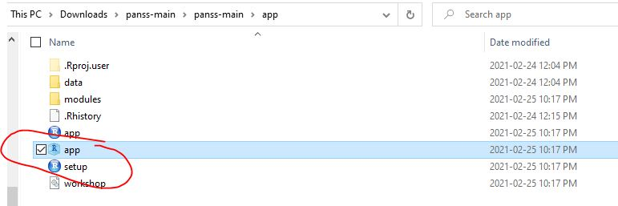
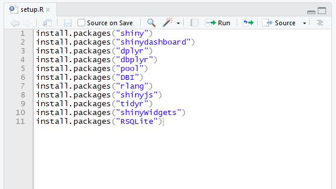
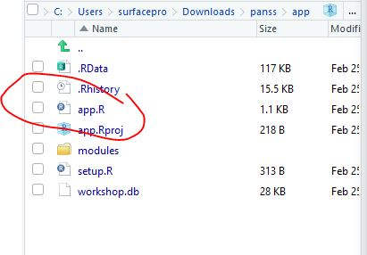
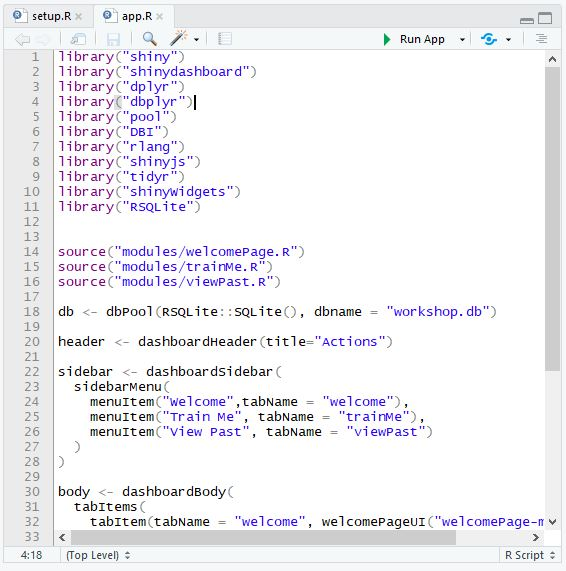
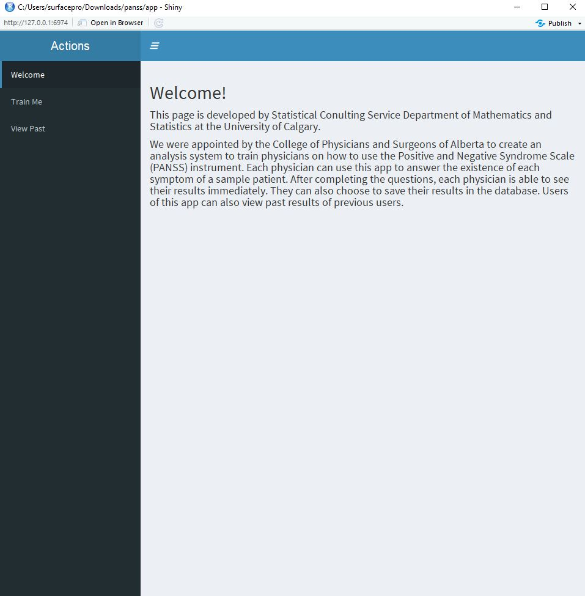

# panss

## Requirement

This program requires R and RStudio, which can be downloaded and installed
through the following links:

### R

- <https://www.r-project.org/>

### RStudio

- <https://rstudio.com/products/rstudio/download/>

## Run App

Once R and Rstudio has been downloaded and installed, do the following:

1. Download a .zip of this project by clicking the green button `Code` on this page and click `Download ZIP`.

    

2. Extract the zip folder using your system instructions and open the zip folder.

   

3. Once the folder is extract, open the project by going to the `panss-main` folder then `app` folder and opening clicking on `app.Rproj`.

    
     
4. (One time step. Only do this step when you first download the software. Skip this step after performing it once) Once Rstudio is open, navigate to the bottom right panel. Go to steup.R and `CTRL`+`A` and then `CTRL`+`ENTER` the entire R script to install all the packages. It may ask you to restart, just keep saying yes until all the packages are installed. This step can take up to 10 minutes.

    
    
    

6. Going back to the bottom right panel, open the `app.R` file.  `CTRL`+`A` and then `CTRL`+`ENTER` the entire R script to run the program.

    
    
    
     
4. A new window should open up containing the web program.

    
 
